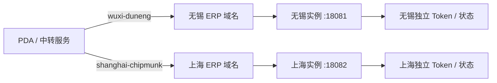

# ERP 双账套与正式服务器迁移方案

## 架构

同一台服务器运行两个独立后端进程，而不是在一个进程中混放两套畅捷通凭据：



| 账套标识 | 显示名称 | 出库单尾号规则 | ERP 仓库 | 默认端口 |
| --- | --- | ---: | --- | ---: |
| `wuxi-duneng` | 无锡笃能 | 3 位 | 无锡仓库 | `18081` |
| `shanghai-chipmunk` | 上海花栗鼠 | 2 位 | 无锡总仓 | `18082` |

每个实例分别保存 AppKey、AppSecret、软证书、消息密钥、`orgId`、Token 和
采购入库审核消息状态。状态文件会写到：

```text
<CHANJET_STATE_DIR>/wuxi-duneng/chanjet-state.json
<CHANJET_STATE_DIR>/shanghai-chipmunk/chanjet-state.json
```

后端会校验状态文件中的 `accountKey` 和 Token 的 `orgId`，避免复制或配置错误后
跨公司查询。

## 部署文件

可直接使用的模板位于 [server/deploy/README.md](../server/deploy/README.md)：

- 两套账号环境变量模板
- `systemd` 双实例服务模板
- Nginx 双域名反向代理模板
- 配置权限、启用顺序与健康检查说明

测试服务器和正式服务器统一使用
`/opt/palm-warehouse/multi-account/server` 作为双账套代码目录；旧测试服务仍可保留在
`/opt/palm-warehouse/server`，两者互不覆盖。

中转服务通过 `X-Erp-Account-Key` 选择目标，并为两个目标分别保存内部访问密钥。
旧版单目标地址和单密钥仍保留兼容，不建议正式环境继续使用。

## 迁移原则

正式运行后应长期保留两个 ERP 二级域名。以后更换服务器只切换 DNS，不更改 APK
中的业务路径，也不需要重新配置畅捷通回调。迁移必须在旧实例停止写入后复制状态
目录，并逐个核对 `/health` 与 `/api/erp/health` 返回的账套标识和 `orgId`。

如果保留统一公网网关，在 `erp-proxy.config.json` 的 `hostAccounts` 中配置
“二级域名 -> 账套标识”。网关只负责分流，不运行 Token 续期；Token、软证书和消息
状态仍分别保存在两个账套实例中，避免同一账号被两个进程同时刷新。

现阶段只有无锡笃能凭据时，只启动无锡实例。上海花栗鼠的配置槽位和路由已经保留，
待第二个企业自建应用准备完毕后填写对应模板并启动第二个实例即可。
